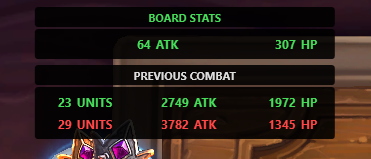

# BoardStatsPlugin

A lightweight statistics overlay for **Hearthstone Battlegrounds**, designed as a plugin for **Hearthstone Deck Tracker**.

BoardStatsPlugin automatically displays the combined Attack and Health of each board. During combat, it also tracks how many minions are summoned or brought back through **Reborn**.

(images/Capture d’écran 2026-07-21 174744.png)

## About the Project

I created BoardStatsPlugin as a personal challenge.

I am not a professional programmer, but I have always wanted a simple way to see the total statistics of a Battlegrounds board without calculating everything manually.

Raw statistics are not the most important part of every fight, but they are fun to follow and can sometimes be useful, especially near the end of a lobby. The summon counter also makes it easier to understand and compare Deathrattle, Reborn, and summon-heavy compositions.

## Features

* Displays the total Attack and Health of all minions on each board.
* Automatically updates board statistics.
* Works during both the Recruitment and Combat phases.
* Displays statistics for both the player and the opponent when available.
* Counts minions summoned during combat.
* Counts minions brought back through Reborn.
* Keeps the previous combat totals available for comparison.
* Integrates directly into the Hearthstone Deck Tracker overlay.
* Lightweight and designed specifically for Battlegrounds.

## Why Use BoardStatsPlugin?

BoardStatsPlugin provides additional visual information during a game. It can help you:

* Compare your board with an opponent’s board.
* Follow the growth of a scaling composition.
* Quickly estimate the overall size of a board.
* Compare late-game fights.
* See how many additional minions were generated during combat.
* Measure the impact of Deathrattles, Reborn effects, and summon-based compositions.
* Keep track of impressive or unusual boards.

Total Attack and Health do not tell the complete story of a fight. Divine Shield, Cleave, Venomous, Reborn, Deathrattles, minion effects, and attack order can all matter more than raw numbers.

BoardStatsPlugin is therefore an informative and entertaining tool, not a combat prediction system.

## For Twitch and YouTube Creators

BoardStatsPlugin can also provide useful visual information for Twitch streams and YouTube videos.

Viewers can immediately compare the size of both boards and see how many minions are generated during a fight. This can encourage discussions and predictions, especially when:

* Two very large boards fight each other.
* A composition gains a large amount of stats in one turn.
* Deathrattle or Reborn compositions generate many additional minions.
* Players approach the final stages of a lobby.
* Viewers try to predict the result of the next fight.
* A statistically weaker board wins through effects or attack order.

These visible statistics can create additional entertainment and give viewers more information to discuss during a stream.

## Installation

1. Go to the [latest release page](https://github.com/Reign-in-blood/HDT-BoardStatsPlugin/releases/tag/v0.2.8).
2. Download `BoardStatsPlugin.dll`.
3. Open Hearthstone Deck Tracker.
4. Go to:

   `Options → Tracker → Plugins`

5. Drag and drop the downloaded DLL into the plugins window.
6. Restart Hearthstone Deck Tracker if necessary.
7. Make sure BoardStatsPlugin is enabled.
8. Launch Hearthstone and start a Battlegrounds game.

Do not download the automatically generated files named **Source code**. They contain the project files, not the compiled plugin required for installation.

The source code is publicly available for transparency and may be inspected, used, or forked under the terms of the project license.

## Feedback and Bug Reports

Feedback is welcome.

To report a bug or suggest an improvement, open a [GitHub Issue](https://github.com/Reign-in-blood/HDT-BoardStatsPlugin/issues).

Please include your plugin version, HDT version, and a screenshot when possible.

## Support the Project

* Try the plugin.
* Report bugs.
* Suggest improvements.
* Share it with other Battlegrounds players.
* Use it in a Twitch stream or YouTube video.
* Star the repository on GitHub.

## To Do

* Make the statistics panels movable.
* Add customization options.
* Improve the overall visual design.
* Add support for traditional Hearthstone game modes.

## Disclaimer

BoardStatsPlugin is an independent community project.

It is not affiliated with, endorsed by, or officially supported by Blizzard Entertainment, HearthSim, HSReplay.net, or Hearthstone Deck Tracker.

Hearthstone and Hearthstone Battlegrounds are trademarks or registered trademarks of Blizzard Entertainment, Inc.

## License

This project is licensed under the MIT License. See the [`LICENSE`](https://github.com/Reign-in-blood/HDT-BoardStatsPlugin/blob/main/LICENSE) file for details.
